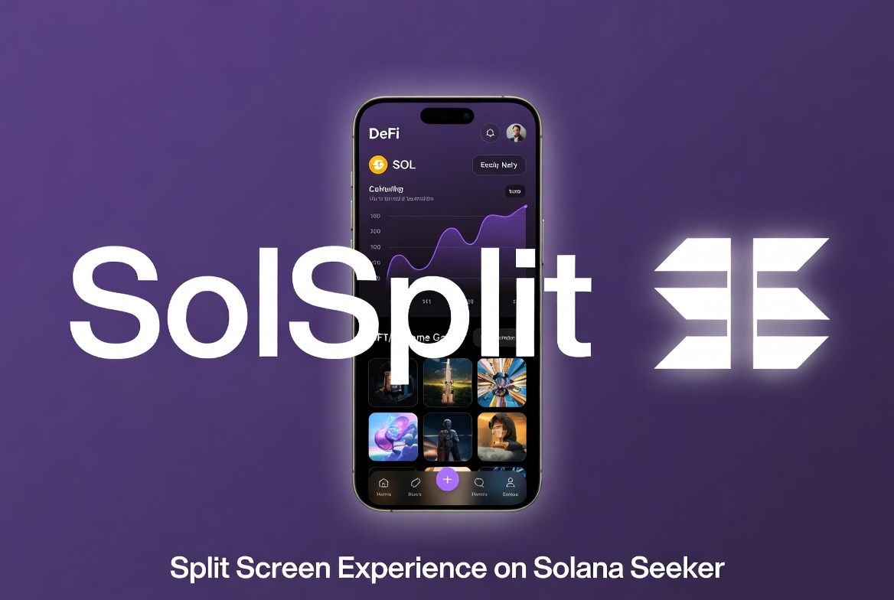

# SolSplit AKA SolSplitter

**Instant split-screen launcher for Solana Seeker**

Open any two apps side-by-side with one tap. Save your favorite pairs and pin them to your home screen for quick access.

### ✨ Features
- One-tap split screen for any two installed apps
- Save and manage favorite pairs (Wallet + DEX, Charts + Trading, etc.)
- Pin saved pairs directly to your home screen
- Clear visual feedback when selecting apps
- Clean Solana-themed dark interface

### 📱 Screenshots

### Installation
1. Download the latest `app-release.apk` from the [Releases page](https://github.com/trademark979/SolSplit/releases)
2. Transfer the APK to your Solana Seeker
3. Install and enjoy split-screen multitasking

### Pro Tip
For the best first-time experience, open both apps manually once before using split launch.

### Links
- [Privacy Policy](PRIVACY.md)
- [Terms of Use](TERMS.md)

---

**Built for the Solana ecosystem.**

Star ⭐ if you find it useful!
